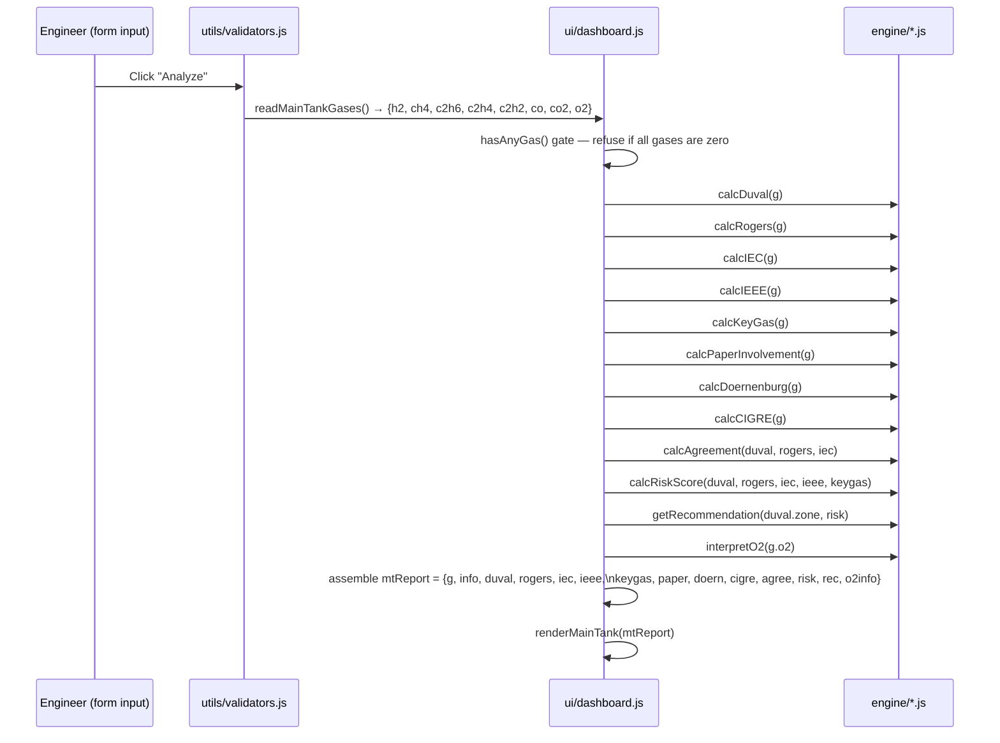
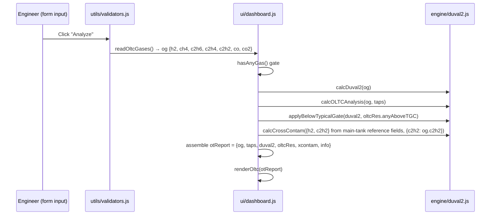
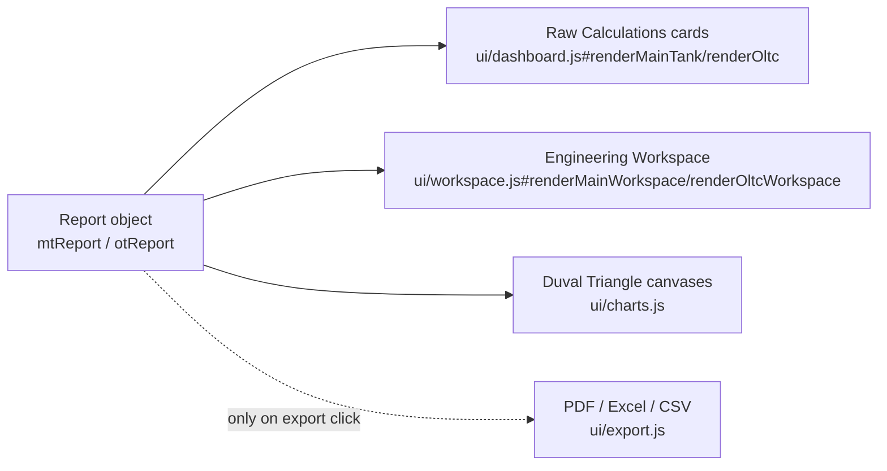

# TAILAM — Calculation Flow

How gas values become a complete report object. This document describes
**sequencing and composition only** — for the actual thresholds and
formulas of each method, see `docs/standards/` (implementation notes) and
the JSDoc comments in `src/js/engine/*.js` (the authoritative source).

## 1. Main Tank calculation sequence

Every engine call above receives the **same gas object** `g`. No method's
output feeds into another method's threshold logic — the only compositions
are: (a) `calcAgreement` comparing three already-computed results, and
(b) `calcRiskScore` combining five already-computed results into one
weighted number. Both are documented, reviewable compositions, not hidden
recalculation.

## 2. OLTC calculation sequence

OLTC has no multi-method consensus score (there is only one primary
triangle for the OLTC compartment), so `otReport` never contains an
`agree`/`risk` pair analogous to the main tank's — the Engineering
Workspace explicitly labels Confidence/Agreement as not applicable for
OLTC rather than deriving a number that doesn't exist in the engine.

## 3. The IEC §9 "below-typical" gate

`applyBelowTypicalGate` is the one place in the OLTC flow where a
zone result is conditionally re-labeled rather than just displayed: per
IEC 60599:2022 clause 9, a Duval Triangle 2 fault zone only represents an
active fault if at least one gas exceeds its CIGRE TB 443 typical
concentration. If none do, the zone is flagged `belowTypical` and displayed
in the healthy visual style with an added advisory sentence — the
underlying zone classification itself is never altered, only its
presentation.

## 4. Report object → render fan-out

All four consumers on the right read the same report object built once in
§1/§2. `ui/workspace.js` never invents a new threshold — every editorial
choice it makes (e.g. mapping a 4-band health score to a 5-word decision
vocabulary) is documented inline in the source with a `JUDGMENT:` comment
and is presentation-only.

## 5. What never happens

- No engine function is ever called with a value derived from another
  engine function's *threshold logic* (only with already-computed *result
  objects*, as in `calcAgreement`/`calcRiskScore` above).
- No UI module recomputes a ratio, zone, or score independently — every
  number displayed anywhere in the app traces back to exactly one call
  into `engine/*.js`.
- No calculation depends on the transformer-information fields (name, MVA,
  voltage, location, date, oil type) — those are descriptive metadata only.
