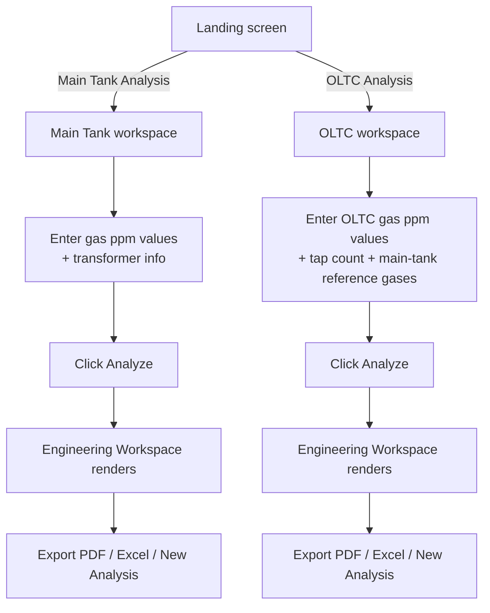

# TAILAM — Engineering Workflow

How a transformer engineer's raw DGA lab result becomes a TAILAM report,
described from the user's side rather than the code's side. See
`Calculation_Flow.md` for the internal computation sequence and
`Module_Structure.md` for which file does what.

## 1. Two independent workflows

TAILAM has exactly two analysis workflows, selected from the landing
screen: **Main Tank** and **OLTC**. They are independent from first input to
final export — running one never affects the other, and a report from one
cannot be mixed into the other's export.

## 2. Main Tank workflow

1. **Enter gas values.** Seven combustible/carbon-oxide gases in ppm (H₂,
   CH₄, C₂H₆, C₂H₄, C₂H₂, CO, CO₂) plus optional dissolved O₂. At least one
   gas must be non-zero to run an analysis.
2. **Enter transformer information** (optional, defaults applied if left
   blank): name, MVA rating, voltage, location, sample date, oil type. This
   information is descriptive only — it appears on reports and is never
   used in any calculation.
3. **Click Analyze.** TAILAM runs all eight main-tank diagnostic methods
   against the same gas set (see `Calculation_Flow.md`) and builds one
   report object.
4. **Review the Engineering Workspace**, which presents, in order:
   Engineering Snapshot → Engineering Status → Engineering Assessment
   (with the Duval Triangle 1 hero visualization) → Operational Decision →
   Immediate Action Plan → Transformer Health Index → Engineering
   Interpretation → Supporting Evidence → Diagnostic Methods table → Raw
   Calculations (collapsible, full per-method detail) → Engineering
   References → Export.
5. **Export or start a new analysis.** PDF and Excel exports capture
   exactly what is on screen for this analysis; "New Analysis" clears the
   form and hides the results.

## 3. OLTC workflow

1. **Enter OLTC gas values** (H₂, CH₄, C₂H₆, C₂H₄, C₂H₂, CO, CO₂) and,
   optionally, the tap-change operation count since the last oil change.
2. **Enter main-tank reference values** (H₂, C₂H₂) for the
   cross-contamination check — TAILAM pre-fills these automatically from a
   completed Main Tank analysis if one exists in the same session, but they
   can be entered independently.
3. **Click Analyze.** TAILAM runs Duval Triangle 2, the CIGRE TB 443
   typical-gas-concentration (TGC) comparison, three OLTC diagnostic
   ratios, the tap-normalized C₂H₂ check, and the cross-contamination
   check.
4. **Review the Engineering Workspace** (same eleven-section structure as
   Main Tank, populated with OLTC-specific content — OLTC has no
   multi-method consensus score, so Confidence/Agreement are explicitly
   shown as not applicable rather than a fabricated number).
5. **Export or start a new analysis**, same as Main Tank.

## 4. What happens if you switch tabs mid-analysis

If an analysis has been run but not yet exported, switching to the other
workspace or back to the landing screen triggers a confirmation dialog:
export as PDF, export as Excel, discard, or cancel. This exists to prevent
losing an unexported analysis by accident — TAILAM keeps no server-side or
disk copy, so once a report is discarded or the tab is closed, it cannot be
recovered.

## 5. Interpreting the Engineering Workspace

| Section | What it tells the engineer |
|---|---|
| Engineering Snapshot | Five-second read: condition, most probable fault, operational decision, confidence, method agreement |
| Engineering Status | Plain-language condition + a one-to-two-line summary |
| Engineering Assessment | The primary diagnostic (Duval Triangle) with its full triangle plot, plus supporting method summary |
| Operational Decision | One of a fixed set of engineering actions (Continue Operation / Increase Monitoring / Schedule Inspection / Immediate Investigation Required) |
| Immediate Action Plan | Prioritized, sourced action items derived from the triggered findings across all methods |
| Transformer Health Index | The weighted 0–100 composite score and its band |
| Engineering Interpretation | A short, report-style paragraph summarizing the above in professional language |
| Supporting Evidence | Which methods were available/unavailable for this sample and what they contributed |
| Diagnostic Methods table | Every method that ran, its individual result, and whether it agrees with the primary diagnostic |
| Raw Calculations | Full per-method detail — ratios, thresholds, zone plots — for engineers who want to see the underlying numbers |
| Engineering References | The standards TAILAM implements, with one-line descriptions |

Every value in every section above is read from the single report object
built in step 3/3 of the relevant workflow — nothing is recalculated
between sections, so the Snapshot, the Diagnostic table, and the Raw
Calculations can never disagree with each other.
