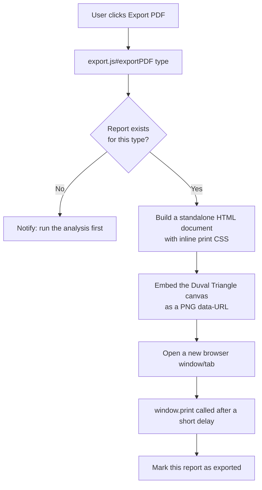
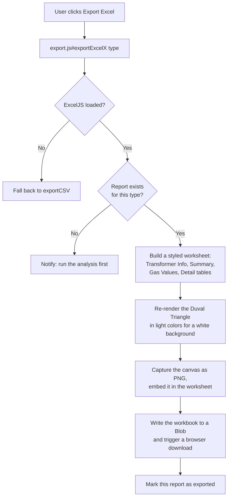

# TAILAM — Export Workflow

TAILAM produces three export formats, all generated entirely in the
browser with no server round-trip. This document describes how each one is
built and how they relate to the on-screen report. Implemented in
`src/js/ui/export.js`.

## 1. Export formats

| Format | Trigger | Library | Fallback |
|---|---|---|---|
| PDF | "Export PDF" button | None — opens a new browser window with print-ready HTML/CSS and calls `window.print()` | N/A (always available) |
| Excel (.xlsx) | "Export Excel" button | ExcelJS (pinned CDN version) | Automatic plain CSV if ExcelJS failed to load |
| CSV | Automatic fallback only | None | — |

## 2. Strict single-analysis separation

Every export function takes a `type` argument (`'main'` or `'oltc'`) and
reads **only** that panel's report object. A PDF exported from the OLTC
workspace can never contain Main Tank content, and vice versa — there is
no combined-report export in Version 1.0 (see `ROADMAP.md` for future
multi-analysis reporting).

## 3. PDF export flow

The PDF is not the on-screen page printed as-is — it is a **separate,
purpose-built HTML document** constructed fresh from the report object,
with its own print-oriented CSS (`ui/export.js` contains this markup
directly; it does not read `src/css/print.css`, which governs the
in-browser print view instead). This keeps the printable report
independent of any on-screen layout change.

## 4. Excel export flow

The Duval Triangle image embedded in the Excel file is **re-drawn** in
light theme colors immediately before capture (via
`theme.js#setForceLightCanvas`) so it stays legible printed or viewed on a
white background, then the on-screen (dark or light, per the user's actual
theme) canvas is restored. This is a rendering-only step — the underlying
zone/point data plotted is identical to what the user sees on screen.

## 5. CSV fallback

If `ExcelJS` is not defined on `window` (CDN blocked, offline, ad
blocker, etc.), `exportExcelX` transparently calls `exportCSV` instead. CSV
export contains the same transformer info, gas values, and diagnostic
results as the Excel export, without styling or the embedded triangle
image — it exists purely so a report can still be extracted without any
external dependency.

## 6. What export never does

- Never recalculates a diagnostic value — every number in every export
  format is read directly from the same report object the on-screen
  Engineering Workspace was built from.
- Never uploads anything — `exportPDF` opens a local browser window;
  `exportExcelX`/`exportCSV` build a `Blob` and trigger a local download.
  No network request is made to transmit report content anywhere.
- Never blocks on the ExcelJS CDN load at page-load time — the script tag
  uses `defer` and the app only checks for `ExcelJS`'s presence at the
  moment the user actually requests an Excel export.

## 7. Exported-state tracking

`ui/dashboard.js` tracks, per panel, whether the current report has been
exported at least once (`mtExported` / `otExported`). This is what powers
the "unsaved analysis" navigation guard described in
`Engineering_Workflow.md` §4 — it has no effect on the export content
itself.
