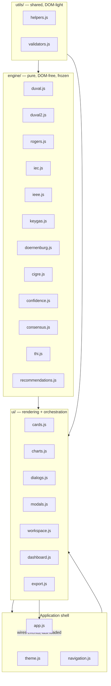

# TAILAM — Module Structure

File-by-file responsibility reference for `src/js/`. For the load order and
the historical reasoning behind the plain-script (non-ES-module) approach,
see `docs/ARCHITECTURE.md`.

## 1. Layer overview

*(The `UI --> Shell` arrow is theme/navigation registering redraw and
tab-shown callbacks, not a hard dependency — see §3.)*

## 2. Engine layer (`src/js/engine/`) — frozen for Version 1.0

| File | Responsibility |
|---|---|
| `duval.js` | Duval Triangle 1 (main tank, IEC 60599:2022 Fig. B.3) and Duval Triangle 4 (low-temperature supplementary triangle) |
| `duval2.js` | Duval Triangle 2 (OLTC, IEC 60599:2022 Fig. B.4) plus all other OLTC-compartment engineering: TGC comparison, diagnostic ratios, tap-count normalization, cross-contamination checks, the IEC §9 below-typical gate |
| `rogers.js` | Rogers four-ratio method |
| `iec.js` | IEC 60599 three-ratio method, CO₂/CO paper-involvement assessment, dissolved-O₂ interpretation |
| `ieee.js` | IEEE C57.104 individual-gas condition limits |
| `keygas.js` | Key Gas method + TDCG (Total Dissolved Combustible Gas) condition bands |
| `doernenburg.js` | Doernenburg ratio method |
| `cigre.js` | CIGRE five-key-ratio screening method |
| `confidence.js` | Agreement-level → confidence-percentage lookup |
| `consensus.js` | Cross-method agreement between Duval Triangle 1, Rogers and IEC 60599 |
| `thi.js` | Transformer Health Index — weighted 0–100 risk score and health-category bands |
| `recommendations.js` | Maintenance recommendation text per Duval Triangle 1 zone |

Every function in this layer takes a plain gas-value object in and returns a
plain result object out. None of them read `document`, `window` (beyond
publishing their own namespace), or any other module's output except where
explicitly composed (e.g. `thi.js#calcRiskScore` takes the already-computed
Duval/Rogers/IEC/IEEE/Key Gas results as arguments).

## 3. Utility layer (`src/js/utils/`)

| File | Responsibility |
|---|---|
| `helpers.js` | Gas display labels, HTML escaping, ratio formatting, zone→severity-class mapping, the shared condition-number→severity-class map |
| `validators.js` | All form reading and input parsing — every DOM read of a user-entered value funnels through this file |

## 4. UI layer (`src/js/ui/`)

| File | Responsibility |
|---|---|
| `cards.js` | Tiny, reusable DOM-write helpers (`setText`, `setResultBox`, `flagHTML`) |
| `charts.js` | All canvas rendering — Duval Triangles 1, 2, 4 and the risk gauge |
| `dialogs.js` | User-facing blocking notifications (currently a thin wrapper around the native `alert`) |
| `modals.js` | About / Help dialogs and the unsaved-analysis navigation guard |
| `workspace.js` | The Engineering Workspace presentation layer — reads the report object built by `dashboard.js` and relabels/aggregates it into the eleven-section layout; introduces no new engineering value |
| `dashboard.js` | Orchestration: reads validated input, calls the engine functions, builds the report object, holds per-panel state, triggers rendering |
| `export.js` | PDF (print-ready window), Excel (styled `.xlsx` via ExcelJS), and CSV (fallback) generation — each strictly single-analysis |

## 5. Application shell

| File | Responsibility |
|---|---|
| `theme.js` | Dark/light theme state, persistence, and the "force light" override used when capturing canvases for white-background exports |
| `navigation.js` | Landing / Main Tank / OLTC view switching |
| `app.js` | The only file that calls `addEventListener` — wires every button/link to its handler, registers cross-module callbacks, runs first-load initialization. Loaded last. |

## 6. Why the dependency graph has no cycles

`workspace.js` and `dashboard.js` each need something the other module
produces (dashboard needs workspace's render functions; workspace's modal
needs dashboard's report getters), but `workspace.js` loads *before*
`dashboard.js` in `index.html`. Both modules resolve this the same way:
they read `window.TAILAM.ui.<other module>` **inside a function body**, at
call time, never at the top of their IIFE. By the time either function
actually runs (a user has clicked something), both namespaces are fully
populated — the load-order constraint only applies to code that executes
immediately when the script tag runs, and neither module does that here.

## 7. Frozen vs. presentation code

| Layer | Frozen for v1.0? | Reason |
|---|---|---|
| `engine/*.js` | Yes | Contains every threshold, ratio boundary, and zone geometry — verified against the standards referenced in `docs/standards/` |
| `utils/*.js` | Yes (semantics) | Read-only helpers and input parsing; formatting-only changes are lower risk but still require a documented reason |
| `ui/*.js`, `theme.js`, `navigation.js`, `app.js` | UI layout frozen; internal refactors permitted | Presentation and orchestration only — never computes a new diagnostic value |
