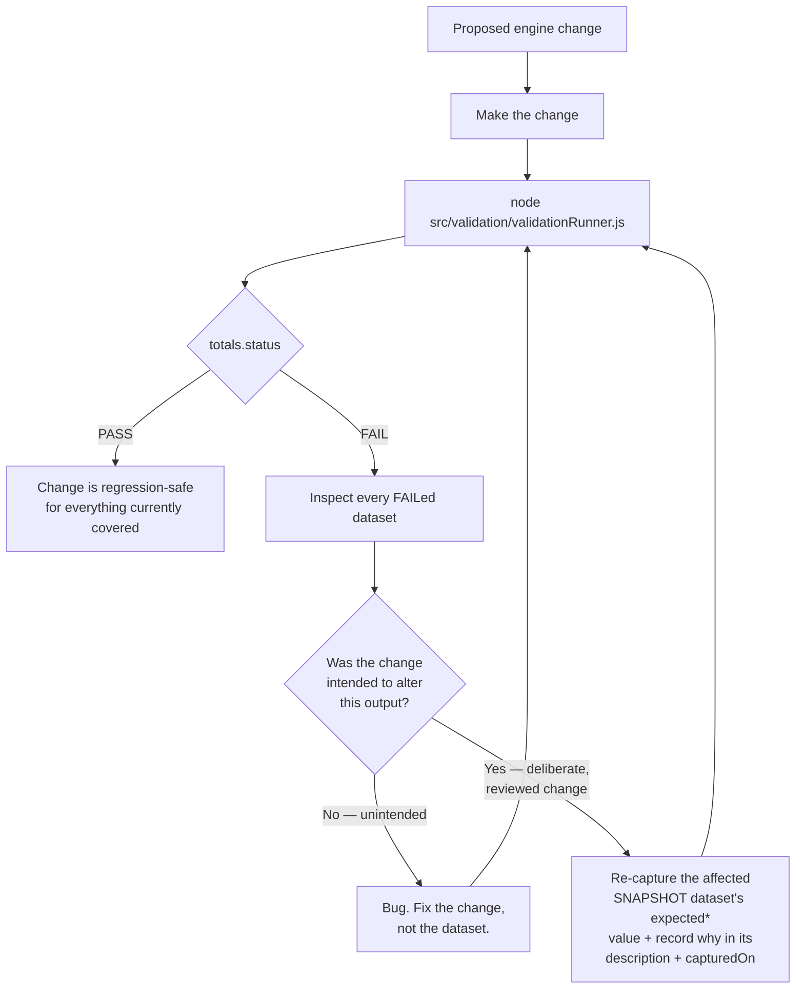

# TAILAM — Regression Process

The procedure for changing anything in `src/js/engine/` without silently
breaking a diagnostic calculation. TAILAM's engine is frozen for Version
1.0 — this process is what governs any *future* change to it, in a later
version.

## 1. The core rule

**No change to `src/js/engine/*.js` ships without a full validation run
showing `totals.status === "PASS"`, and every resulting `FAIL` explicitly
understood before the run is re-executed.**

## 2. Why "the change" is suspect by default

A `FAIL` after an engine edit means one of exactly two things: the edit
introduced a bug, or the edit deliberately changes behavior the validation
suite hadn't been told to expect yet. The process above treats a `FAIL` as
a bug until proven otherwise — the burden of proof is on updating the
dataset with a recorded justification, never on silently trusting the new
output.

## 3. Re-capturing a snapshot after a deliberate change

When an engine change is intentional (e.g. a reviewed correction to a
threshold, applied through the same engineering-review process that
governs any engine change):

1. Run the affected method's validator and note the new actual output.
2. Update the dataset's `expectedResult`/`expectedZone`/`expectedRatios` to
   the new value.
3. Update `capturedOn` to the current date.
4. Add a note to the dataset's `description` explaining what changed and
   why (referencing the engineering review that approved it).
5. Re-run the full suite and confirm `PASS`.
6. Record the change in `docs/release/CHANGELOG.md`.

A `REFERENCE` (published-standard) dataset failing is more serious than a
`SNAPSHOT` failing — see `Validation_Checklist.md` §3. It should never be
"fixed" by editing the reference value; it means either the engine has a
genuine defect or the dataset was transcribed incorrectly from the
standard, and both require investigation before proceeding.

## 4. Extensibility without touching existing data

The framework was built so that expanding it never requires editing
existing, already-passing datasets:

- **A future standard revision** (e.g. a new IEC 60599 edition) is added
  as new datasets with a different `revision` value in the same method
  folder — existing datasets stay dated to their own revision.
- **A new diagnostic method** (e.g. a future Duval Pentagon) needs: a new
  `datasets/<Method>/` folder following the existing schema, one new
  `run<Method>Validation()` function in `validationRunner.js`, and one new
  line in `runAllValidation()`'s method list and the console report's
  ordering — no existing method's code or data changes.

## 5. What this process does not cover

This is a calculation-correctness regression process. It does not cover
UI regressions (no automated UI test suite exists in Version 1.0 — see
`docs/release/ROADMAP.md`), PDF/Excel output formatting regressions, or
browser-compatibility regressions. Those remain manual QA steps until a
future version adds automated coverage for them.
